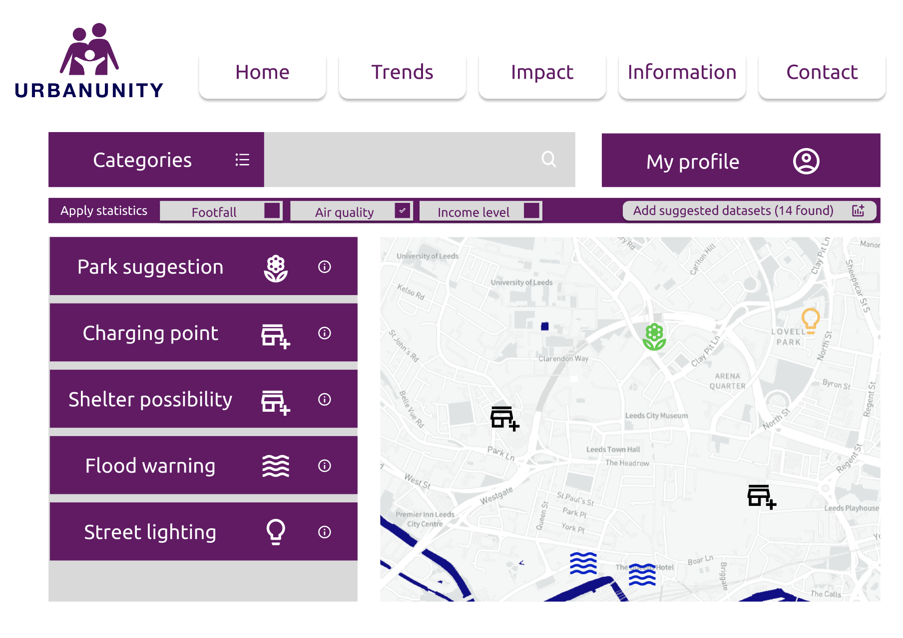
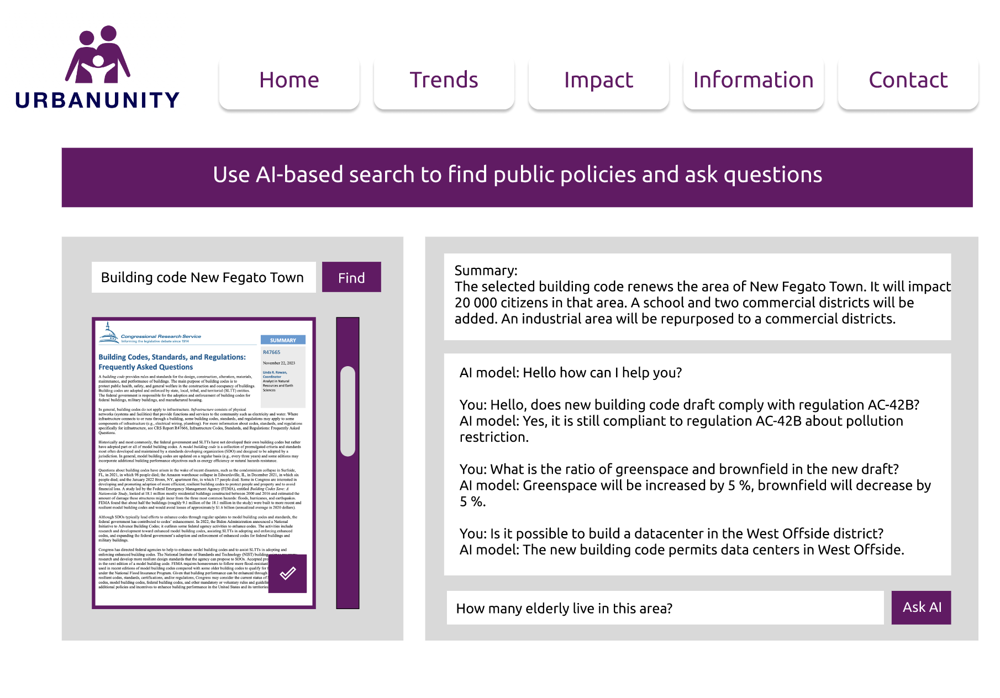
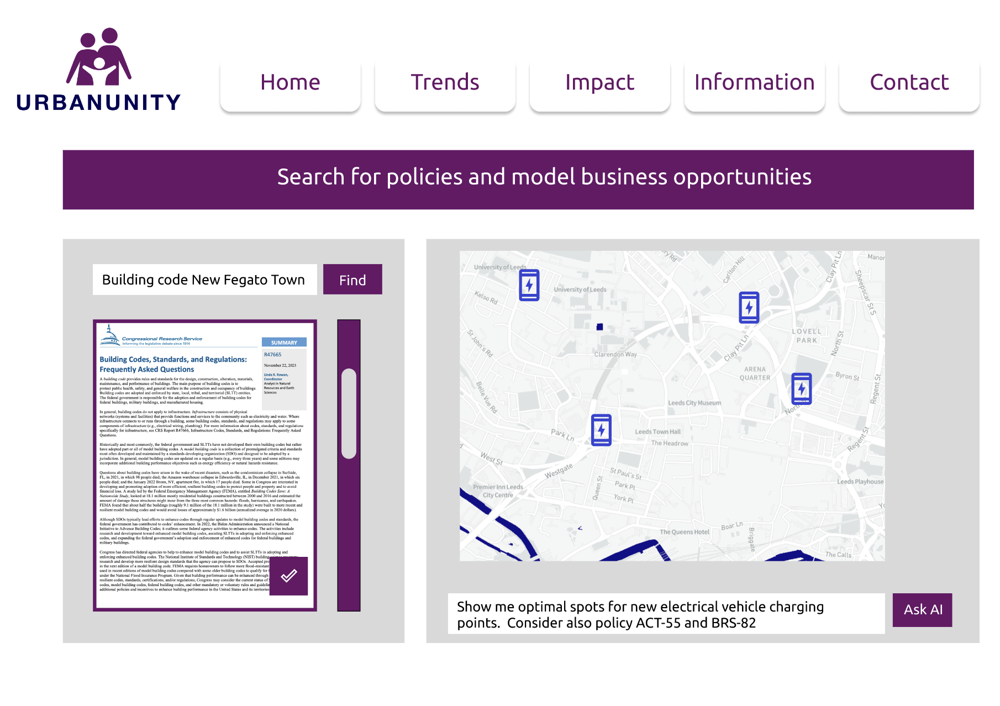
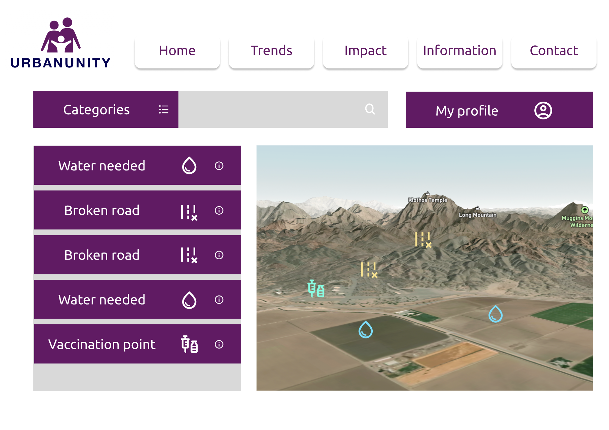
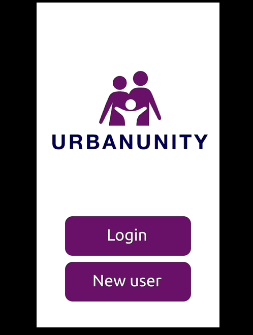
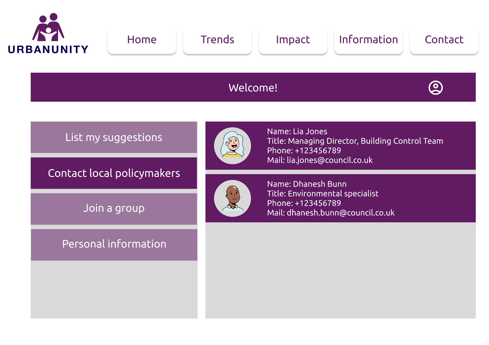
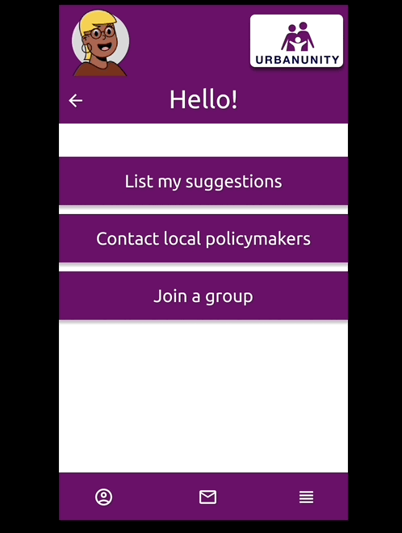

# CloudNativeHacks - UrbanUnity
This repository contains the code for a proof of concept application where users can mark a point on a map and suggest something the community needs, for example adding more streetlights to make walking during darker hours more safe.

The tool an also be used by policymakers or service providers to understand how a policy impacts a geographical area. In addition, the suggestion features can be used by NGOs to notice where to target help.

The app is meant to run as a webapp with a dashboard usable in a browser and on mobile devices. In the design phase we want to create a design that works both on mobile phones and on computer screens.

[Figma prototype link](https://www.figma.com/proto/cdVboZ27CTvocSOmNRcm0i/cloudnativehacks?type=design&node-id=9-126&t=A2TJIiOLCg8KP0yR-1&scaling=scale-down&page-id=0%3A1&starting-point-node-id=5%3A7&show-proto-sidebar=1&mode=design)

## Team
S. Zaidi and C. Lindqvist

## About the webapp
To run the app we use a free account for the Mapbox map API to draw maps. See details in the [Mapbox documentation](https://docs.mapbox.com/help/getting-started/access-tokens/) for how to set it up.

We plan to provide a guide for how to set up your own instance as future work. It is also a future work to support other map APIs.

## Pitch
How can we make the places we live in fulfill basic needs in a sustainable way? How can governments and society understand the impact a new policy will have on an area and avoid mistakes when creating new policies? How can inhabitants make their own voice heard?

We have created a design and proof of concept for a dashboard application that allows interaction between citizens and policymakers. Users can make suggestions about missing services, dangers, or improvements as a feedback for policymakers to act on. Policymakers (or anyone else running their own instance) can upload public policy documents or drafts for new policies and use generative AI tools to understand how a policy impacts an area by asking questions about the uploaded documents and integrating it with public statistics APIs.

We also propose the possibility to expand the application to be used by NGOs to interact with locals and target help in the best way. Further, we propose the application to be used by service providers and businesses who want to understand how their new business ideas can be impacted by policies that exist in an area.

It is important that the application is Open Source to allow extensions and further development by new communities. It is meant to be localized depending on the geographical area it will be deployed in. It is also meant to be deployable by anyone so that any citizen or service provider can set up an instance and start ingesting public policy documents to get a better understanding of their contents.

## Use case examples
Here are some use case examples for various stakeholders (users, policymakers, service providers, NGOs).
#### Model suggestions cross-correlated with datasets
- Users, policymakers and service providers can model public suggestions. An instance can be set up by a local community to use the modeling tool to improve their own environment.

#### Ask about a policy
- Users, policymakers and service providers can search for policies that are publicly available and use generative AI to ask questions about the impact of this policy.

#### Model a policy on a map
- Service providers or policymakers can model a policy on a map and ask questions using generative AI to explore new business opportunities.

#### Get suggestions from locals how to help
- NGOs can use the suggestion features to explore existing services in an area and discover the needs of local communities.

#### View details about a suggestion
- All users can see details about new proposals. Local policymakers can be tagged to get notified and to filter proposals of a certain type, for example requests to fix a road.

#### View local policymakers
- Users can view contact details for local policymakers.

- Mobile App view of the policymaker viewing interface

## Data and privacy concerns
- We consider only the use of publicly available data.
- A deeper analysis about how to protect user data is needed. Participation in the app is voluntary and user data needs to be kept private. Any sharing of user data is opt-in.
- We also consider that visualising statistics may show data that malicious actors can act upon, for example areas that have less streetlights. This is a problem that needs consideration and further development.

## Future work
- Collaborate with local governments or communities to start using the platform.
- Create a one-click deployment template.
- Provide a guide for how to localize the application and ingest relevant data (e.g. policymaker contact details).
- Do a deep analysis and prevent any misuse of this type of application.
- Do an analysis of accessibility and adapt the design and application accordingly.
- Integrate other map APIs with the application.
- Integrate AI tools with the application to develop the policy analysis features.

## Other resources
- [Full Figma design board with all assets and screens](https://www.figma.com/file/cdVboZ27CTvocSOmNRcm0i/cloudnativehacks?type=design&node-id=0%3A1&mode=design&t=SWLZ1In60ZotbQ9Y-1)

## SDGs targeted by this project
 Policymakers and service providers can see the impact of a new policy and cross-correlate it with statistics, such as air pollution in an area or other factors that impact health. Users can request health services from local governments or NGOs.

 
Gender-specific issues or risks can be raised as concerns to local policymakers or NGOs.

In the NGO use case locals will be able to mark spots where clean water is needed.

Service providers for clean energy can model existing data, statistics and policies to deploy new services in a more efficient way.

Service providers can use the tool to discover new needs for services and create workplaces.

Service providers can collaborate with local government to propose new services needed by the citizens.

Everyone can participate in suggesting improvements to the local policymakers or NGOs to ensure their voice is heard.

Users can interact with policymakers and form local groups for the environment.

Users can alert policymakers or NGOs to natural disasters or risks happening in local lakes, rivers or seashores.

Users can alert policymakers to natural disasters or risks happening in a land area.

Users will be able to influence the decisionmaking directly and ensure that policymakers or NGOs are aware of area-specific challenges.

 
The platform allows everyone to participate. Service providers can form collaborations with citizens and local governments to develop new areas.

